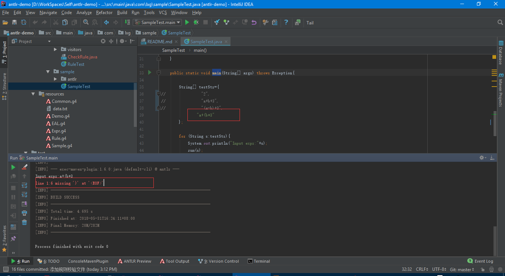

# antlr-demo

## 解析过程
    词法分析-->语法分析
    
## 介绍
ExprLexer 是词法分析器， ExprParser是语法分析器

## 不符合例子

## 资料
[antlr入门与实例](https://blog.csdn.net/dc_726/article/details/45399371)

[Antlr-API](http://www.antlr.org/api/Java/overview-summary.html)